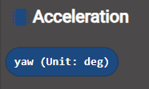

# PKS-Driver

Micro:bit motor drive expansion board. \
https://www.peanutkingstore.com/product/peanut-king-micro-bit-robot-shield-v1-2

## Table of Contents

* [URL](#url)
* [Summary](#summary)
* [Blocks](#blocks)
* [License](#license)

## URL
project URL:  ```https://github.com/PeanutKingSolutionOffical/pxt-pks-shield```

## Summary
The Micro:bit motor drive expansion board not only enhances motor drive capabilities but also incorporates four motor driven, 2 road, on the basis of stepper motor driver, 
also raises the additional 8 road steering gear interface, IO port, 2 road 9 I2C interface.
In addition, it provides an extra eight steering gear interfaces, IO ports, and two 9 I2C interfaces.
The motor uses a high-current interface, while the steering machine, I2C, and IO ports all use the Gravity standard interface, supporting a vast number of modules and sensors. 
The expansion board is powered by a voltage range of 3.5v to 5.5v and offers two power interface modes: a 3.5mm plug and wiring. 
It's known for its wide voltage compatibility, numerous ports, compact size, and plug-and-play convenience.

## Blocks
### 1. Robot


### 2. Compass


## Code Example
Get readings from compound eye
```JavaScript
basic.forever(function () {
    serial.writeNumber(pksdriver.compoundEyeRead(pksdriver.compoundEyeData.max_eye))
    serial.writeNumber(pksdriver.compoundEyeRead(pksdriver.compoundEyeData.max_eye_value))
    basic.pause(1000)
})
```

Get readings from compass
```JavaScript
basic.forever(function () {
    serial.writeNumber(pksdriver.compass_get_yaw())
    basic.pause(1000)
})
```

## More resources
```https://home.peanutkingeducation.com/```

## License

MIT

## Supported targets

* for PXT/microbit
(The metadata above is needed for package search.)
```package
gamePad=github:PeanutKingSolutionOffical/pxt-pks-shield
```
